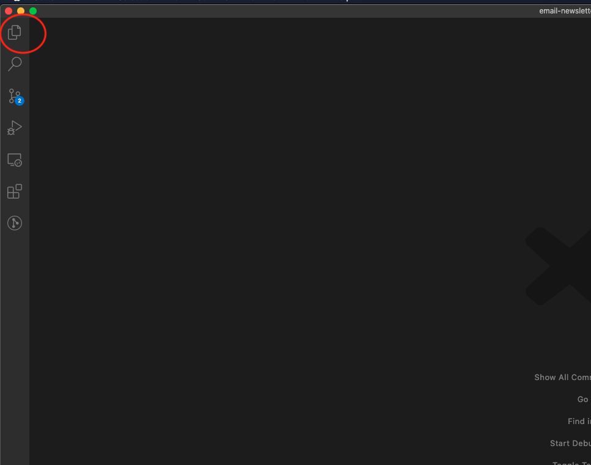

# Stanford Daily Tech Workshop Week 1 Assignment

## Getting started

**If you get stuck at any step, reach out to Holden or Alex and we'll help you out!**

1. If you're on a mac, open up terminal. If you're on a windows machine, open up command prompt.
2. Type (or copy and paste) `git clone https://github.com/TheStanfordDaily/email-newsletter-generator.git` into the terminal/command prompt. Press enter.
   1. You should see something like
```
1. Cloning into 'email-newsletter-generator'...
remote: Enumerating objects: 60, done.
remote: Counting objects: 100% (60/60), done.
remote: Compressing objects: 100% (42/42), done.
remote: Total 60 (delta 24), reused 42 (delta 15), pack-reused 0
Unpacking objects: 100% (60/60), done.
```
3. then run `ls` and look for `email-newsletter-generator` 
4. then run `cd email-newsletter-generator`
5. then run `git checkout tech-wksh-wk1-html-css`
   1. You should see something like
```
Switched to branch 'tech-wksh-wk1-html-css'
Your branch is up to date with 'origin/tech-wksh-wk1-html-css'.
```
6. Open up VS Code, click `open folder` in the welcome page and then find the `email-newsletter-generator` folder and open it.
7. Click the file icon in the top left of VS Code

8. Find the file called `step1.html`. Click on it.
9. Follow the steps in `step1.html` to get started! Once you're done with that, move on to `step2.html`, etc.